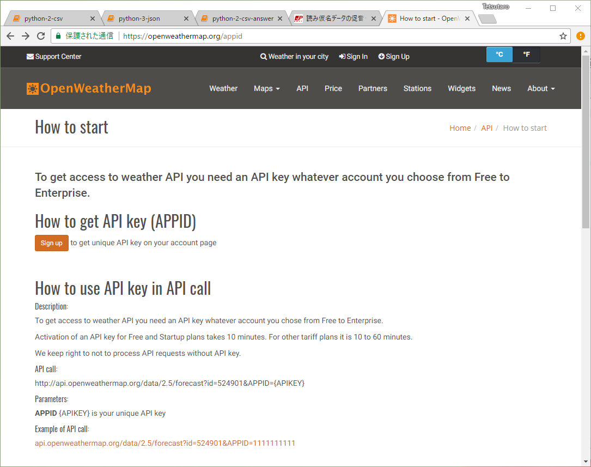
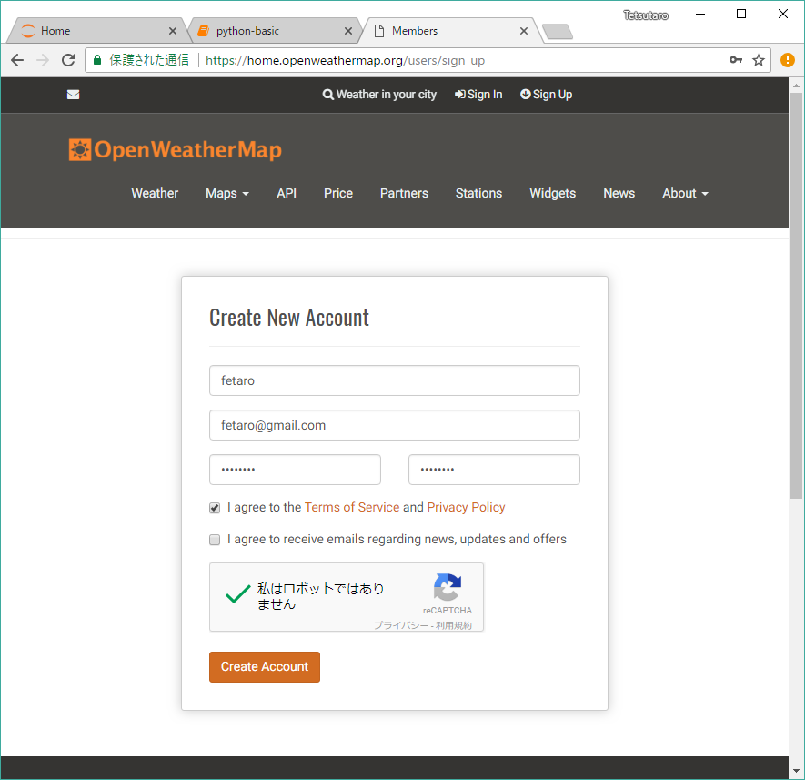
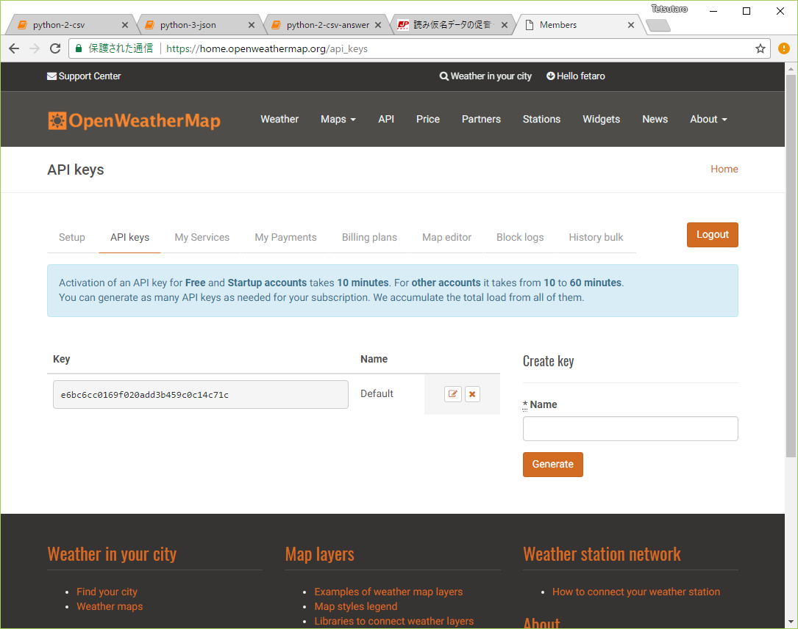

## 事前準備

### 気象情報APIのAPIキーの取得

https://openweathermap.org/price にアクセス



Get API Key and Start をクリック



University of Tokyoを入力し、教育を選ぶ


API Keysのタブを開いてKyesの値をメモする



## APIからデータを取得して表示する


```python
import requests
api_key = "e6bc6cc0169f020add3b459c0c14c71c"
city = "Tokyo"
response = requests.get("http://api.openweathermap.org/data/2.5/weather?q={0}&appid={1}".format(city,api_key))
print(response.text)
```

    {"coord":{"lon":139.76,"lat":35.68},"weather":[{"id":701,"main":"Mist","description":"mist","icon":"50n"}],"base":"stations","main":{"temp":290.15,"pressure":1019,"humidity":67,"temp_min":289.15,"temp_max":292.15},"visibility":16093,"wind":{"speed":2.1,"deg":50},"clouds":{"all":1},"dt":1524409020,"sys":{"type":1,"id":7622,"message":0.0082,"country":"JP","sunrise":1524340757,"sunset":1524388807},"id":1850147,"name":"Tokyo","cod":200}
    

## JSONをディクショナリに変換して表示する


```python
# 今までのプログラムに以下を追記
import json   # JSONライブラリをインポート
json_str = response.text
w_dict = json.loads(json_str)
print(w_dict)
```

    {'coord': {'lon': 139.76, 'lat': 35.68}, 'weather': [{'id': 701, 'main': 'Mist', 'description': 'mist', 'icon': '50n'}], 'base': 'stations', 'main': {'temp': 290.15, 'pressure': 1019, 'humidity': 67, 'temp_min': 289.15, 'temp_max': 292.15}, 'visibility': 16093, 'wind': {'speed': 2.1, 'deg': 50}, 'clouds': {'all': 1}, 'dt': 1524409020, 'sys': {'type': 1, 'id': 7622, 'message': 0.0082, 'country': 'JP', 'sunrise': 1524340757, 'sunset': 1524388807}, 'id': 1850147, 'name': 'Tokyo', 'cod': 200}
    

## ディクショナリをきれいに表示する


```python
# 今までのプログラムに以下を追記
import pprint    # Pretty Printライブラリをインポート
pp = pprint.PrettyPrinter(indent=4)
pp.pprint(w_dict)
```

    {   'base': 'stations',
        'clouds': {'all': 1},
        'cod': 200,
        'coord': {'lat': 35.68, 'lon': 139.76},
        'dt': 1524409020,
        'id': 1850147,
        'main': {   'humidity': 67,
                    'pressure': 1019,
                    'temp': 290.15,
                    'temp_max': 292.15,
                    'temp_min': 289.15},
        'name': 'Tokyo',
        'sys': {   'country': 'JP',
                   'id': 7622,
                   'message': 0.0082,
                   'sunrise': 1524340757,
                   'sunset': 1524388807,
                   'type': 1},
        'visibility': 16093,
        'weather': [   {   'description': 'mist',
                           'icon': '50n',
                           'id': 701,
                           'main': 'Mist'}],
        'wind': {'deg': 50, 'speed': 2.1}}
    

## 時刻を取得


```python
# 今までのプログラムに以下を追記
unix_time = w_dict["dt"]
print(unix_time)
```

    1524409020
    

## UNIXタイムを日本時間で解釈して表示


```python
# 今までのプログラムに以下を追記
from datetime import datetime, timezone, timedelta
JST = timezone(timedelta(hours=+9), 'JST')
time = datetime.fromtimestamp(unix_time,  JST)
print(time)
```

    2018-04-22 23:57:00+09:00
    

## 課題 3-1

時刻、温度、天気、風の強さを取得し、天気予報の日本語文字列を出力せよ

```
出力：2018-04-24 12:00:00+09:00の気温は13.6度、天気はCloud、風の強さは5.1m/sです。
```

ヒント：どこにデータが有るかわからない、データの意味がわからない場合は、データの仕様書 https://openweathermap.org/current を読む

## 課題3-2（時間が余ったら）

天気予報をより流暢な日本語にせよ

出力：4月24日火曜日12時の気温は13度、天気は曇り、風の強さは5.1m/sです。

ヒント：天気の文字列の種類は　https://openweathermap.org/weather-conditions　を見る
